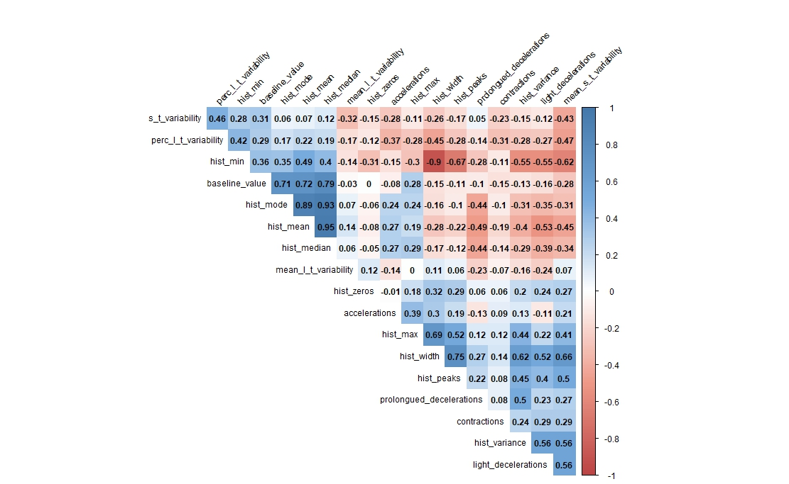

# __4 Techniques for Analyzing Handling Imbalanced Data with Machine Learning Classifiers in R__

In this tutorial, I'll discuss what it means for a dataset to be imbalanced and why this is a problem for machine learning classifiers. Then, I'll present 4 commonly used techniques for effectively training machine learning classifiers on imbalanced data, including how to implement these techniques in R and the pros and cons of each. My goal is to provide a primer for getting started analyzing imbalanced, so I will prioritize the application of these techniques over theory.

## What are Classification Tasks?

Classification is a widely encountered problem in data science. In a classification task, the goal is to develop a model that can reliably place data into one of two or more distinct categories. Classification tasks appear in many different business and research situations. For example, you may want to classify emails as "spam" or "not spam", diagnose patients as having a certain disease or not, determine whether a transaction is fraudulent or not, or predict whether or not a loan will be paid back. In all of these examples, machine learning tools can be used to predict the class that each case belongs. The class is the target variable, and it is predicted based on the predictor variables, or features.

## What is Imbalanced Data, and Why Does it Matter?

A dataset is imbalanced if certain classes are much more common than others. Imagine a bank checking their records of 10,000 transactions and finding that 200 of them (just 2%) are fraudulent. In this example, "no fraud" is the majority class, while "fraud" is the minority class. Those cases of fraud are very important, but the fact that they are rare within the data can make them difficult to predict. 

```{r setup, include = FALSE}
####Do i need this code chunk for a tutorial?
library(knitr)
library(rmarkdown)
knitr::opts_chunk$set(echo = TRUE, message = FALSE, warning = FALSE)
```

``` {r hypothetical imbalanced data, echo = FALSE}

library(ggplot2)
library(forcats)

imbalanced_hypothetical <- as.data.frame(c(rep('legitimate', 9800), rep('fraud', 200)))
colnames(imbalanced_hypothetical) <- "transaction_status"

ggplot(imbalanced_hypothetical, aes(x = fct_relevel(transaction_status, 'legitimate'), 
                                    fill = transaction_status)) +
  geom_bar(show.legend = FALSE) +
  labs(x = 'transaction type',
       y = 'count') +
  theme_classic()

```

Imbalanced data are common, with examples including disease diagnosis, natural disasters, fraud detection, customer churn, and insurance policies.

Lets assume we are using a machine learning model to try and predict the fraud cases, and our model predicts that all 10,000 transactions fall into the "no fraud" category. Since the "no fraud" category is by far the most common category in our data, this model will have 98% accuracy even though it misses every single instance of fraud! Although this model would be highly accurate, it's also completely useless. For this reason, the model accuracy score (measured as the percentage of cases that are correctly classified) should not be used to assess the performance of a model fit to imbalanced data. 

For reasons we'll get into below, models fit to imbalanced data are often biased towards over-predicting the majority class and under-predicting the minority class. This is important since, like in the fraud example, the minority class is often the one we are most interested in being able to predict. So, if we want to assess the performance of a model fit to imbalanced data, we need an alternative to accuracy score that measures how useful a model is. We will consider three metrics that do this by placing greater emphasis on correctly predicting minority classes.

## Model Performance Metrics for Imbalanced Learning

Once you have fit a classifier, you can use it to generate predictions for cases in the testing set. By comparing these predictions to the actual classes in the testing set, you can calculate numerous model performance metrics. Let's discuss the most commonly used metrics.

### Accuracy 

Accuracy is the number of true positives (TP) and true negative (TN) divided by the number of cases: 

Accuracy = (TP + TN) / (TP + TN + FP + FN) 

As we found above, accuracy can be misleading for classifiers when working with imbalanced data.

### Precision 

Precision is the number of true positives divided by all positives: 

Precision = TP / (TP + FP). 

It is used to measure how prone your model is to false positives (e.g. how likely your model is to mistake legitimate transactions for fraudulent ones).

### Recall 

Recall is the number of true positives divided by true positives and false negatives: 

Recall = TP / (TP + FN) 

It measures how prone your model is to false negatives (e.g. how likely your model is mistake fraudulent transactions for legitimate ones).

### F-measure

The F-measure conviniently combines both Precision and Recall into one metric:

F-measure = (2 * Precision * Recall) / (Precision + Recall)

Since the F-measure takes into account the model's proneness to both false positives and false negatives, it is an excellent way to measure the overall quality of the model's performance.

## Fitting a Classifier to Imbalanced Data

Now that we have a reliable metric for assessing model performance, let's look at how to fit a model that is likely to perform well on imbalanced data. We'll start by considering how the model fitting process works.

Generally speaking, supervised learning algorithms, including classifiers, learn by using a cost function. This cost function quantifies the difference between the model's predictions (for the training set) and the actual values of the target variable. In the model fitting process, the model's parameters are tuned to minimize the cost function. One way to think about this is that the cost function is the metric of model performance used during this optimization process.

In the case of imbalanced data, a large majority of cases belong to one class, and so the cost function will almost entirely be determined by whether the model accurately classifies cases belonging to this one class. This is a problem because it means that the cost function can be reduced by tuning the parameters to classify nearly all cases into the majority class irrespective of their feature values. This leads to a bias in favor of the majority class.

Several techniques exist for avoiding this bias. Let's explore 4 common techniques, including how to implement them and their pros and cons.

### 1. Undersampling the Majority Class

We can balance the dataset by randomly deleting cases from the majority class until the classes have similar numbers of cases. This approach is easy to implement and avoids adding noise or bias into your data. The obvious drawback is that it reduces your sample size, meaning that you have less data with which to tune the parameters in your model. Consequently, undersampling is best used in situations where your dataset is large enough that you will still have many thousands of cases and at least 10 cases per feature after undersampling.

``` {r undersampling_diagram, echo = FALSE}

library(tidyverse)

undersampling_classes = c(rep('legitimate', 9800), rep('fraud', 200), 
                          rep('legitimate', 200), rep('fraud', 200))
undersampling_technique = c(rep('original', 10000), rep('undersampled', 400))
hypothetical_data_undersampling <- as.data.frame(cbind(undersampling_technique, undersampling_classes))

ggplot(hypothetical_data_undersampling, aes(x = fct_relevel(undersampling_classes, 'legitimate'), 
                                            fill = undersampling_classes)) +
  geom_bar(show.legend = FALSE) +
  labs(x = 'transaction type',
       y = 'count') +
  theme_classic() +
  facet_wrap(~ undersampling_technique)

```


### 2. Oversampling the Minority Class - Resampling

We can also balance the dataset by using resampling to increase the size of the minority class. This technique consists of  randomly duplicating cases in the minority class until the dataset is balanced. This approach is easy to implement and avoids reducing your sample size. However, since resampling creates exact copies of cases, it increases the risk of overfitting.

``` {r resampling_diagram, echo = FALSE}

resampling_classes = c(rep('legitimate', 9800), rep('fraud', 200), 
                       rep('legitimate', 9800), rep('fraud', 9800))
resampling_technique = c(rep('original', 10000), rep('oversampled (resampling)', 19600))
hypothetical_data_resampling = as.data.frame(cbind(resampling_classes, resampling_technique))

ggplot(hypothetical_data_resampling, aes(x = fct_relevel(resampling_classes, 'legitimate'), 
                                         fill = resampling_classes)) +
  geom_bar(show.legend = FALSE) +
  labs(x = 'transaction type',
       y = 'count') +
  theme_classic() +
  facet_wrap(~ resampling_technique)

```

### 3. Oversampling the Minority Class - Synthetic Minority Oversampling Technique (SMOTE)

Another method to increase the size of the minority class is to add synthetic data using SMOTE. This technique interpolates new data between existing cases in the minority class. In essence, SMOTE draws lines connecting each minority class case to its nearest neighbors. The number of nearest neighbors to use per point is determined by the user. A synthetic data point is then created at a random point along each line. This method will generates reasonable minority class data if the true distribution of the minority class is continuous (i.e. the space between existing minority class cases are likely to hold minority class cases). This assumption is not always correct, so it's worth thinking about the underlying distribution of the minority class before using SMOTE. SMOTE is less likely to cause overfitting than resampling because you are creating new data instead of exact copies. However, the new data may not always reflect the true distribution of the variables, so SMOTE increases the noise in the data.

``` {r smote_diagram, echo = FALSE}

library(smotefamily)

#make the dataset have only two levels (for simplicity's sake)
filtered_iris <- iris %>%
  filter(Species != 'virginica')
filtered_iris_imbalanced <- filtered_iris[41:nrow(filtered_iris),]

#change structure of Species to only have 2 levels
filtered_iris_imbalanced$Species <- as.character(filtered_iris_imbalanced$Species)
filtered_iris_imbalanced$Species <- as.factor(filtered_iris_imbalanced$Species)

SMOTEd_iris <- SMOTE(filtered_iris_imbalanced[,1:4], filtered_iris_imbalanced$Species, K = 3, dup_size = 4)

names(SMOTEd_iris$data)[names(SMOTEd_iris$data) == "class"] <- "Species"
iris_combined <- rbind(filtered_iris_imbalanced, SMOTEd_iris$data)

iris_combined$technique <- c(rep('original', nrow(filtered_iris_imbalanced)), 
                             rep('oversampled (SMOTE)', nrow(SMOTEd_iris$data)))

ggplot(iris_combined, aes(x = Sepal.Length, y = Sepal.Width, colour = Species)) +
  geom_point(show.legend = FALSE) +
  facet_wrap(~ technique) +
  labs(x = 'feature a',
       y = 'feature b') +
  theme_classic()

```

All three methods discussed so far manipulate the dataset by adding or removing cases. These techniques should only ever be applied to the training set. The testing set should be untouched by these techniques, otherwise you cannot be confident that it provides a realistic test of the model's performance.

### 4. Cost-Sensitive Learning

Cost-sensitive learning consists of adjusting the cost function to more greatly penalize the model when it miss-classifies a minority class case than a majority class case. Typically, the weightings assigned to members of each class are inversely proportional to the size of each class. For example, if there are 9,800 legitimate cases and 200 fraudulent cases, we would use the weighting 10,000 / (2 * 9,800) = 0.51 for the legitimate class and 10,000 / (2 * 200) = 25 for the fraudulent class. Used in this way, cost-sensitive learning makes the minority and majority classes have equal weight when tuning of the model. Cost-sensitive learning doesn't require modifying the dataset itself, so you avoid the problems of reduced sample size, noise, or overfitting seen with other approaches. The biggest limitation is that, at the time of writing this post, cost-sensitive learning is only available for a subset of common machine learning classifiers in R.

## A Worked Example

We now have several options for minimizing the biass associated with analyzing imbalanced data. Next, let's work through how to implement these techniques in R, and how to decide which technique leads to the best results. The classifier that we will use in this example is Support Vector Machine (SVM), since it is a versatile and widely-used machine learning classifier that support cost-sensitive learning in R. If you are interested in learning more about how SVM works and when to use it, check out my tutorial on [machine learning classifiers](https://github.com/mitcheljamesdaniel/Classifiers_in_R) where I compare the advantages and limitations of several widely-used machine learning classifiers.

We will work with the fetal health dataset from Ayres de Campos et al. (2000). The target variable in this dataset is fetal heart health, which contains three classes: normal, suspect, and pathological. There are 21 different measurements taken from Cardiotocograms that we can use as features. 

To start, the dataset needs a tiny bit of cleaning to get it ready to use. I give the columns more concise names, which will improve the readability of our figures. I also convert the features measured as integers to type integer, convert an ordinal feature to type ordered, and convert the target to type factor.

``` {r data_cleaning}

library(readr)

#read in the dataset as a data frame
fetal_data <- as.data.frame(read_csv("fetal_health.csv"))

#assign concise feature names
colnames(fetal_data) <- c("baseline_value", 
                          "accelerations", 
                          "fetal_movement", 
                          "contractions", 
                          "light_decelerations", 
                          "severe_decelerations", 
                          "prolongued_decelerations", 
                          "s_t_variability", 
                          "mean_s_t_variability", 
                          "perc_l_t_variability", 
                          "mean_l_t_variability", 
                          "hist_width",
                          "hist_min",
                          "hist_max",
                          "hist_peaks",
                          "hist_zeros",
                          "hist_mode",
                          "hist_mean",
                          "hist_median",
                          "hist_variance",
                          "hist_tendency",
                          "fetal_health")

#convert the variables measured as integers to type integer
int_variables = c("baseline_value", "s_t_variability", "perc_l_t_variability", "hist_width", "hist_min", "hist_max", "hist_peaks", "hist_mode", "hist_mean", "hist_median", "hist_variance")
for(i in int_variables){
  fetal_data[[i]] = as.integer(round(fetal_data[[i]]))
}

#convert the target variable to type factor
fetal_data$fetal_health = as.factor(fetal_data$fetal_health)

#convert histogram tendency to type ordered because it is a qualitative, ordered variable
fetal_data$hist_tendency = as.ordered(fetal_data$hist_tendency)

```

Next, let's look at the distribution of the target variable. We can see it is imbalanced, with the normal heart health class being much more common than suspect or pathological.

``` {r imbalanced_health}

library(ggplot2)

#plot the number of cases in each class of our target variable
ggplot(fetal_data, aes(x = fetal_health, fill = fetal_health)) +
  geom_bar() +
  scale_x_discrete(labels=c('normal', 'suspect', 'pathological')) +
  labs(x = 'fetal health classification') +
  theme_classic() +
  theme(legend.position = "none")

```

Next, we will perform a few variable selection steps. Typically, features that have little variance (e.g. mostly repeated values) contain little information about the target variable and so should be excluded from analysis. Since our target variable is strongly imbalanced, discrete features that strongly predict the target are likely to have lots of repeated values. Consequently, we want to be more cautious than usual about throwing out variables just because they have of lots of repeated values. For this reason, We will only drop two variables have extremely high proportions of repeated values.

Here, we can see two features with the extreme numbers of repeated values. We will drop these features from the dataset further down.

``` {r variables_with_repeated_values}

#plot the distribution of two predictor variables that have extremely higher numbers of repeated values
hist(fetal_data$fetal_movement,
     xlab = "fetal movement",
     ylab = "frequency",
     main = NULL)
hist(fetal_data$severe_decelerations,
     xlab = "severe decelerations",
     ylab = "frequency",
     main = NULL)

#exclude fetal movement and severe decelerations from dataframe because they have too many repeated values
fetal_data <- fetal_data %>%
  mutate(fetal_movement = NULL,
         severe_decelerations = NULL)
```

We also want to eliminate redundant variables (i.e. features that are strongly correlated with one another). Dropping redundant variables enhances model accuracy and computation time, and omits only trivial amounts of information. After excluding the two variables with extreme numbers of repeated values, we can look at the correlogram for the remaining continuous predictors. We can see that histogram median is strongly correlated with histogram mean and mode. We will keep histogram median and drop histogram mean and mode since median has the strongest correlations with the variables in this set, minimizing information loss. Histogram width and histogram minimum are strongly correlated, so we drop histogram minimum.

``` {r redundant_variables, fig.show='hide'}

library(dplyr)
library(corrplot)

#create data frame of just continuous predictors
cont_predictors = fetal_data %>%
  mutate(fetal_health = NULL,
         hist_tendency = NULL)
#create correlation matrix
corrs <- round(cor(cont_predictors), 2)
#create correlogram with no/weak correlations in white, strong positive correlations in blue, and strong negative correlations in red
col <- colorRampPalette(c("#BB4444", "#EE9988", "#FFFFFF", "#77AADD", "#4477AA"))
corrplot(corrs, method="color", col=col(200),  
         type="upper", order="hclust", 
         addCoef.col = "black", # Add coefficient of correlation
         tl.col="black", tl.srt=45, #Text label color and rotation
         #hide correlation coefficients on the diagonal
         diag=FALSE,
         tl.cex = .75, #text label size
         number.cex=0.75, #number label size
         cl.cex = 0.75)

#drop redundant variables from the data frame
predictors_reduced = cont_predictors %>%
  mutate(hist_mode = NULL,
         hist_mean = NULL,
         hist_min = NULL)

#create data frame combining the variables we want in the analyses (the target, the continuous predictors we are keeping, and the categorical predictors)
predictors_with_response <- predictors_reduced
predictors_with_response['hist_tendency'] <- fetal_data$hist_tendency
predictors_with_response['fetal_health'] <- fetal_data$fetal_health

```


SVM uses the distance among data points in Euclidean space to determine how to classify different cases. In Euclidean space, if some variables are measured on a larger scale then other, they will have an inordinately large impact on the model's parameters, which tends to reduce model performance. To avoid this problem, let's normalize our (quantitative) predictors so that they are all on the same scale. We will do this using datawizard::normalize(). The SVM function we will be using converts categorical predictors to dummy variables automatically, so we don't need to do that conversion in pre-processing.

``` {r normalize_predictors}

library(datawizard)

#create data frame with just the quantitative predictors, normalize them, then recombine them with the target variable and the categorical predictor
normalized_data <- as.data.frame(apply(predictors_with_response[1:15], 2, FUN = normalize))
normalized_data[c('hist_tendency', 'fetal_health')] <- predictors_with_response[,16:17]

```

The next thing we need to do is partition our dataset into training and testing sets. To keep this tutorial concise, we will use a single training and testing set. However, inthe real-world it is usually a good idea to train and test your model multiple times on different partitionings of the data to check whether your model is sensitive to how the data are randomly divided. We will place 80% of the data in the training set and 20% in the testing set, since this standard ratio empirically performs well for most datasets.

``` {r partition_dataset}

#set the seed so that the partitioning will be consistent across different techniques
seed = 29
set.seed(seed)

#create an index and use it to randomly subset the data into testing and training sets
#Note that while the indices are sampled with replacement, cases are ultimately sampled without replacement (i.e. each case is placed in either the training or testing set, never both)
partition_ind <- sample(2, nrow(normalized_data), replace = TRUE, prob = c(0.8, 0.2))
svm_train <- normalized_data[partition_ind == 1,]
svm_test <- normalized_data[partition_ind == 2,] 

```

## Undersampling the Majority Class

Undersampling is generally not recommended for a dataset of the size that we are working with, because after performing undersampling we will have a modest number of cases left (715). However, for the purposes of this tutorial, we will compare how well a model trained to undersampled data performs compares to models trained on data using other techniques. We will undersample the majority class using ROSE::ovun.sample(). ovun.sample() can only operate on data with 2 classes. To make it work with our 3-class dataset, we will drop the intermediate class from the data frame, perform undersampling to achieve the desired ratio between our majority and minority classes, and then add the intermediate class back in.

Generating a majority:minority class ratio of 4:1 or less is generally sufficient to minimize the problem of imbalance, and the smaller we make the ratio, the smaller the sample size we end up with. So, let's parameterize the undersampling function to achieve a 4:1 ratio. If working on a real-world project where small differences in model performance are important, then it would be worth trying out multiple ratios and seeing which one leads to the best model performance.

``` {r undersampling_majority}

library(ROSE)

#drop the intermediate class
data_no_class_2 <- svm_train %>%
  filter(fetal_health != 2)

#We set the N argument equal to 5 times the size of the minority class, which achieves the desired ratio of 4:1
undersampled_data_2_classes <- ovun.sample(fetal_health ~ ., 
                                           data = data_no_class_2, 
                                           N = 5 * table(svm_train$fetal_health)[3], 
                                           seed = seed, 
                                           method = "under")$data

#add intermediate class back in
data_intermediate_class <- svm_train %>%
  filter(fetal_health == 2)
undersampled_data <- rbind(undersampled_data_2_classes, data_intermediate_class)

```

Now that we have an undersampled training set, we will train a SVM on this data. We will use e1071::tune() because it supports automated tuning of the hyperparameters that control the model's learning process, making the model training process more efficient. We will use a radial kernel function, since it generally works well for multi-class data. Note that in a real-world scenario, it is usually best to try out multiple kernels to determine the best one.

``` {r train_SVM_on_undersampled_data}

library(e1071)

#train a SVM on our undersampled dataset
#use a wide range of cost and gamma hyperparameters to increase the odds the model tuning settles on a near-optimal value (see <classifiers project for more info>)
undersampled_svm <- tune(svm, fetal_health ~ ., data = undersampled_data, kernel = "radial",
                 ranges = list(cost = c(0.1, 1, 5, 10, 50, 100, 1000),
                               gamma = c(0.01, 0.05, 0.1, 0.25, 0.5, 1, 2, 3, 4)))

```

Now that we've trained our model, we will get the model to predict class membership for cases in the training set, and use those predictions to assess model performance. We will use caret::confusionMatrix(), which calculates a variety of performance metrics, including the ones we are interested in. Precision, Recall, and F1 measure are calculated separately for each of the three classes, so we can use these values to see how useful the model is for predicting all three levels of heart health.

``` {r assess_undersampled_svm_performance}

library(caret)

#get predictions from the best model
undersampled_pred <- predict(undersampled_svm$best.model, svm_test)

#calculate accuracy
undersampled_accur <- sum(undersampled_pred == svm_test$fetal_health) / length(svm_test$fetal_health)
undersampled_accur

#generate confusion matrix and calculate performance metrics
undersampled_confusion_matrix <- confusionMatrix(undersampled_pred, svm_test$fetal_health, 
                                                 mode = "everything", positive = "1")
undersampled_confusion_matrix$byClass[1:3,5:7]
```

The accuracy of the svm fit to undersampled data is high. But, as we discussed above, we shouldn't rely solely on accuracy with analyzing an imbalanced dataset. Precision, Recall, and the F1 score are very high for the majority class (class 1), but are a mix of high and moderate values for the intermediate (class 2) and minority (class 3) classes:

These performance metrics suggest that undersampling did not adequately fix the problem of imbalance in the our dataset. This could be because the sample size is relatively small for using undersampling, and/or because we did not completely balance the data in order to avoid further reducing the sample size.

Let's see if other methods of accounting for the imbalance in the data result in better model performance.

## Oversampling the Minority Class - Resampling

We will use the same seed and the same partitioning of the data so that the results are directly comparable for the different methods we are exploring. Just like before, we will aim for a 4:1 majority:minority class ratio. Creating a smaller ratio than this would unnecessarily increase the risk of overfitting.

The ovun.sample() function automatically oversamples whichever is the smaller of the two classes you give it. In our case, we have two classes that are dramatically smaller than the majority class. So, we will use the function twice - once for the minority class and once for the intermediate class.

``` {r oversampling_minority}

#drop the majority class
data_no_class_1 <- svm_train %>%
  filter(fetal_health != 1)

#oversample the minority class
#set N equal to 1/4 the size of the majority class, plus the size of the intermediate class, resulting in 4:1 ratio between majority and minority class
oversampled_minority <- ovun.sample(fetal_health ~ ., data = data_no_class_1,
                                          N = table(svm_train$fetal_health)[1]/4 +
                                              table(svm_train$fetal_health)[2],
                                          seed = seed, method = "over")$data

#oversample the intermediate class
#set N equal to 1/4 the size of the majority class, plus the size of the minority class, resulting in 4:1 ratio between majority and intermediate class
oversampled_data_2_classes <- ovun.sample(fetal_health ~ ., data = oversampled_minority,
                                          N = table(svm_train$fetal_health)[1]/4 + 
                                              table(oversampled_minority$fetal_health)[2],
                                          seed = seed, method = "over")$data

#add majority class back to data frame
data_majority_class <- svm_train %>%
  filter(fetal_health == 1)
oversampled_data <- rbind(oversampled_data_2_classes, data_majority_class)

```

Next, we train a SVM on our oversampled data.

``` {r training_svm_on_oversampled_data}

#train SVM on oversampled data
oversampled_svm <- tune(svm, fetal_health ~ ., data = oversampled_data, kernel = "radial",
                 ranges = list(cost = c(0.1, 1, 5, 10, 50, 100, 1000),
                               gamma = c(0.01, 0.05, 0.1, 0.25, 0.5, 1, 2, 3, 4)))

```

Then, we can assess how the model trained on oversampled data performs.

``` {r assess_oversampled_svm_performance}

#get predictions from the best model
oversampled_pred <- predict(oversampled_svm$best.model, svm_test)

#calculate accuracy
oversampled_accur <- sum(oversampled_pred == svm_test$fetal_health) / length(svm_test$fetal_health)
oversampled_accur

#calculate confusion matrix and a variety of performance metrics
oversampled_confusion_matrix <- confusionMatrix(oversampled_pred, svm_test$fetal_health, 
                                                mode = "everything", positive = "1")
oversampled_confusion_matrix$byClass[1:3,5:7]

```

When trained to oversampled data, the model has high accuracy. The F1 score is again high for the majority class, but is relatively low for the intermediate and minority classes. We can also see that Recall for classes 2 and 3 in particular are lower for the model trained on oversampled data, suggesting that this model is more likely to miss cases of suspect and pathological heart health compared to the model trained to undersampled data. 

For these reasons, undersampling seems like the more effective technique of the two for this dataset. Let's see how to the other techniques compare.

## Oversampling the Majority - SMOTE

The SMOTE function available in R cannot handle non-numeric data. To work around this, we can convert the single, non-numeric predictor to type numeric, use the SMOTE technique, and then convert the predictor variable back to type ordered. This workaround is not perfect; it will interpolate data that are slightly off of the line connecting neighboring points when the predictor is represented as ordinal instead of numeric, introducing a little noise into the data. However, since we will be assessing the model's performance we will know whether this work-around hurts the model's usefulness compared to the other techniques we are using.

As with the previous techniques, we want a 4:1 majority:minority class ratio or lower. The more data with synthesize with SMOTE, the more noise we introduce. So, we will obtain a ratio close to 4:1. We will use smotefamily::SMOTE(). This function automatically generates synthetic data from the smallest class you give it. So, we will use the SMOTE functions twice - once to increase the size of the minority class, and again to increase the size of the intermediate class.

``` {r SMOTE}

library(smotefamily)

#convert hist_tendency to numeric
svm_train$hist_tendency <- as.numeric(svm_train$hist_tendency)

#the SMOTE function multiplies the number of cases in the minority class by an integer
#we triple the size of the minority class to obtain a ratio slightly below 4:1
SMOTEd_minority <- SMOTE(svm_train[,-17], svm_train$fetal_health, K = 5, dup_size = 2)

#We will double the size of the intermediate class to obtain a ratio slightly below 4:1
SMOTEd_minority_and_interm <- SMOTE(SMOTEd_minority$data[,-17], 
                                    SMOTEd_minority$data$class, K = 5, dup_size = 1)

#check that class sizes are now suitable
table(SMOTEd_minority_and_interm$data$class)

#extract the dataset, including the synthesized data
SMOTEd_data <- SMOTEd_minority_and_interm$data

#change hist_tendency back to type ordered
SMOTEd_data$hist_tendency <- as.ordered(round(SMOTEd_data$hist_tendency))

#SMOTE automatically renames the target variable, so we change the name back to 'fetal_health'
names(SMOTEd_data)[names(SMOTEd_data) == 'class'] <- 'fetal_health'

#SMOTE automatically converts the target variable to type string, so we change it back to type factor
SMOTEd_data$fetal_health <- as.factor(SMOTEd_data$fetal_health)

```

Next, we train our SVM on the dataset balanced by SMOTE.

``` {r train_SVM_on_SMOTEd_data}

SMOTE_svm <- tune(svm, fetal_health ~ ., data = SMOTEd_data, kernel = "radial",
                 ranges = list(cost = c(0.1, 1, 5, 10, 50, 100, 1000),
                               gamma = c(0.01, 0.05, 0.1, 0.25, 0.5, 1, 2, 3, 4)))

```

And we will assess the performance of the SVM trained on the data balanced using SMOTE.

``` {r assess_SMOTEd_svm_performance}

#get predictions
SMOTEd_pred <- predict(SMOTE_svm$best.model, svm_test)

#calculate accuracy
SMOTEd_accur <- sum(SMOTEd_pred == svm_test$fetal_health) / length(svm_test$fetal_health)
SMOTEd_accur

#calculate confusion matrix and performance metrics
SMOTEd_confusion_matrix <- confusionMatrix(SMOTEd_pred, svm_test$fetal_health, mode = "everything", 
                                                        positive = "1")
SMOTEd_confusion_matrix$byClass[1:3,5:7]

```

The SMOTE technique led to the best accuracy so far. Precision, Recall, and the F1 score are again a mix of high and moderate values.

Overall performance seems to be fairly similar to the SVM trained on undersampled data, suggesting that transforming our ordinal variable to an integer to perform SMOTE likely did not introduce much noise into the data.

Now, let's move on the final technique.

## Cost-sensitive Learning

Unlike the other techniques we have explored, cost-sensitive learning consists of altering the model's cost function instead of altering the training data. This is done by specifying class weights that alter how much impact each class has on the cost function.

``` {r specify_class_weights}

#create class weights that are inversely proportional to the size of each class
svm_class_1_weight <- nrow(svm_train) / (2*table(svm_train$fetal_health)[1])
svm_class_2_weight <- nrow(svm_train) / (2*table(svm_train$fetal_health)[2])
svm_class_3_weight <- nrow(svm_train) / (2*table(svm_train$fetal_health)[3])
svm_class_weights = c(svm_class_1_weight, svm_class_2_weight, svm_class_3_weight)

```

Then, we use give the SVM these class weights using the the class.weights argument.

``` {r train_svm_using_class_weights}

#convert hist_tendency to type ordered, to match it's type in svm_test
svm_train$hist_tendency <- as.ordered(svm_train$hist_tendency)

#train SVM using class weights
cost_sensitive_svm <- tune(svm, fetal_health ~ ., data = svm_train, kernel = "radial",
                 ranges = list(cost = c(0.1, 1, 5, 10, 50, 100, 1000),
                               gamma = c(0.01, 0.05, 0.1, 0.25, 0.5, 1, 2, 3, 4)),
                 class.weights= svm_class_weights)

```

And then we can assess the performance of the cost sensitive SVM.

``` {r assess_cost_sensitive_SVM}

#get predictions
cost_sensitive_pred <- predict(cost_sensitive_svm$best.model, svm_test)

#calculate accuracy
cost_sensitive_accur <- sum(cost_sensitive_pred == svm_test$fetal_health) / length(svm_test$fetal_health)
cost_sensitive_accur

#calculate confusion matrix and performance metrics
cost_sensitive_confusion_matrix <- confusionMatrix(cost_sensitive_pred, 
                                                   svm_test$fetal_health, mode = "everything", 
                                                   positive = "1")
cost_sensitive_confusion_matrix$byClass[1:3,5:7]

```

Overall, cost-sensitive learning led to slightly higher performance than the previous methods. Accuracy is high. Precision, Recall, and the F1 score are generally slightly above what we saw with previous techniques:

One reason why cost-sensitive learning may have led to the best performance is that it corrects for the imbalance in the data without altering the dataset itself (so this technique avoids increasing noise, reducing sample size, increasing the risk of overfitting). For this reason, cost-sensitive learning is often a great choice when working with imbalanced data (for the classifiers that support it).

In general, there is no one best technique for dealing with imbalanced data. The pros and cons we've discussed provide some guidance on which options to consider. Once you identified which techniques are suitable, it is worth trying out more than one to decide which technique leads to the best results. 'Best' here will depend on the specific goals of your project. Is it more important to catch all cases that belong to the minority class, even if that means getting some false positives? In that case, prioritize a high Recall value. Is avoiding false positives most important, even if that means missing some true positives? In that case, Precision is the priority. Or, if you want to balance both false positives and false negatives, the F1 score is a good metric to focus on.

## Conclusion

I hope this article gave you a useful overview of some of the common techniques for working with imbalanced data, how to implement these techniques in R, and how to compare their impacts on model performance. The code underlying this tutorial is in the Imbalanced_data_explanatory_project.RMD file, should you want to check out how it all works yourself.

## References

Ayres de Campos et al. (2000). SisPorto 2.0 A Program for Automated Analysis of Cardiotocograms. J Matern Fetal Med 5:311-318.
